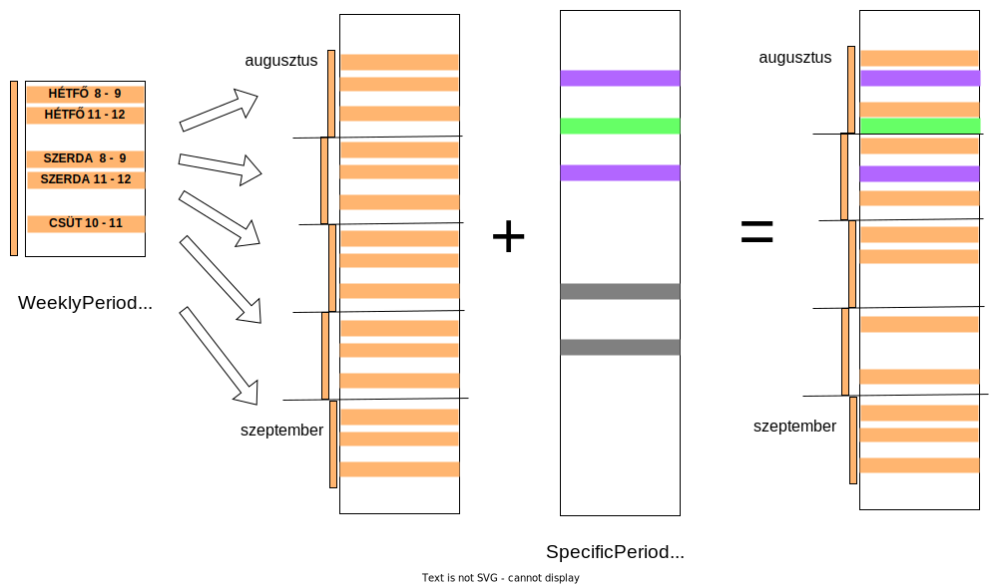

# Vizsgaremek

## Leírás

Backend egy olyan alkalmazáshoz, amivel különböző szolgáltatásokra lehet időpontot foglalni.

### Funkciók szolgáltatóknak

A szolgáltatók meghirdetik a szolgáltatásaikat és beállítják, mely időpontokban érhetőek el.
Az időpontokat kétféleképpen lehet megadni:

1. Hetente ismétlődő periódusok (WeeklyPeriod)
2. Egyszeri alkalmak, ezek felülírják a heti menetrendet (SpecificPeriod)

A lenti ábra mutatja, ez hogyan működik:
- A heti menetrend van bal oldalon. A WeeklyPeriod csak a hét napjaihoz kötött. 
- Foglalni viszont konkrét dátumokat lehet, ehhez a heti menetrendet le kell képezni ismétlésekkel az idővonalra. Ez a második oszlop. Az így kapott blokkokat narancssárgán jelöltem.
- A SpecificPeriod már az idővonalat módosítja. Lehet új foglalható időpontokat hozzáadni (zöld), módosítani meglévőket (lila), vagy törölni (szürke).
- Az utolsó oszlop a módosítások utáni idővonal. 
 
Az adatbázisban csak a WeeklyPeriod és a SpecificPeriod van mentve. A TimeTableService feladata az ábrán látható leképezések elvégzése. A teljes idővonalat nem lehet lekérni, csak egy meghatározott darabját (például 2022. jún 1. 6 órától - 2022. aug 5. 18 óráig), hiszen végtelen sokszor ismétlődnek a hetek. 



### Funkciók ügyfeleknek

Az ügyfelek foglalhatnak időpontokat. Az ábrán jobb oldalt létrehozott idővonalról választanak.

### Domain objektumok

#### Boose (Bookable Service röviden)

Tulajdonságok:
- név
- leírás

Például ha van egy fodrászat, akkor minden egyes fodrásznak lehet egy saját Boose-a. Ezekhez tartoznak az időpontok, amiket foglalni lehet. Adott Boose adott időpontját nem foglalhatja le két különböző ügyfél.

#### WeeklyPeriod

Ez már feljebb szerepelt, a heti menetrendben egy időpont. Például Kedd 8:00-tól 8:30-ig. Mindig egy Boose-hoz tartozik.

Tulajdonságok:
- kezdet
- vég
- megjegyzés
- Boose amihez tartozik

Egy ilyen periódus akár átnyúlhat a hét végén, például vasárnaptól hétfőig.

#### SpecificPeriod

Szintén volt feljebb. Ezek már konkrét dátumokhoz kötöttek. Például 2022. június 20. 8 órától 10 óráig. Ez is egy Boose-hoz tartozik.

Tulajdonságok:
- kezdet
- vég
- megjegyzés
- típus:
  - ADD_OR_REPLACE, ha felülírja a hetit és foglalható (zöld és lila volt az ábrán)
  - REMOVE, ez is felülírja a hetit, csak nem foglalható (szürke)
- Boose amihez tartozik

#### Customer

Az ügyfelek foglalják az időpontokat.

Tulajdonságok:
- név
- email

#### Booking

Foglalás egy adott időpontra. Mindig egy Customer foglal egy Boose-ra egy szabad időpontot.

Tulajdonságok:
- kezdet
- vég
- megjegyzés
- Boose, amire történt a foglalás
- Customer, aki foglalt

#### TablePeriod
A fenti ábra jobb oldala még nem tartalmazza a foglalásokat, de ha azt is belevesszük akkor kapunk egy időtáblát. (TimeTableService dolga ezt kiszámolni)

Ennek az elemei a TablePeriod-ok, ezek az adatbázisban nem szerepelnek.

Tulajdonságok:
- kezdet
- vég
- megjegyzés
- Booking, ha van foglalás

Aszerint, hogy tartozik-e Booking a TablePeriod-hoz, mondhatjuk, hogy az állapota `FREE` vagy `BOOKED`.

### API végpontok

#### Jelölés

`{id}` : egy id, akár többször is lehet egy url-ben. Ilyenkor mindegyik előfordulás egymástól független id-ket jelöl. Például `/services/{id}/weekly-periods/{id}` -ben az első `{id}` a service-hez tartozik, a második a weekly-periods-hoz.

`<datetime>` : tetszőleges dátum, ISO formátum, például 2022-06-12T08:00

`[&param=value]` : elhagyható paraméter, alább mindkétszer szűrésre használható. Ha el van hagyva, akkor minden elemet visszaad a kérés.

#### Végpontok

- `/services` [GET, POST]
- `/services/{id}` [GET, PUT, DELETE]
- `/services/{id}/timetable?start=<datetime>&end=<datetime>[&filter=FREE]` [GET]
- `/services/{id}/weekly-periods` [GET, POST]
- `/services/{id}/weekly-periods/{id}` [GET, PUT]
- `/services/{id}/specific-periods?start=<datetime>&end=<datetime>[&type=ADD_OR_REPLACE]` [GET, POST]
- `/services/{id}/specific-periods/{id}` [GET, PUT]
- `/services/{id}/bookings?start=<datetime>&end=<datetime>` [GET]
- `/services/{id}/bookings/{id}` [GET, PUT, DELETE]
- `/customers` [GET, POST]
- `/customers/{id}` [GET, PUT, DELETE]
- `/customer/{id}/bookings` [POST]
- `/customer/{id}/bookings?start=<datetime>&end=<datetime>` [GET]
- `/customer/{id}/bookings/{id}` [GET, PUT, DELETE]

### Alkalmazás elindítása
Docker image (`servicebooker:latest`) készítése:
```shell
$ ./docker-rebuild.sh 
```

Ezután docker compose-zal indítható a mysql szerver és az alkalmazás:
```shell
$ docker compose up -d
```

A szerver a `localhost:8080` -on elérhető.

Az SQL szabványban nincs megkötés a minimálisan és maximálisan tárolható dátumokra és lekérdezni sem lehet a szélső értékeket, ezért ezek külön beállításai az alkalmazásnak. Csak a `min-bookable-date` és `max-bookable-date` közötti dátumok lesznek mentve az adatbázisba.

---
#### Leállítás a konténerek megtartásával
```shell
$ docker compose stop
````


---
#### Újraindítás
```shell
$ docker compose start
```
---

#### Konténerek, hálózat és képfájl törlése
```shell
$ docker compose down
$ docker image remove servicebooker
```

### Példa egy foglalásra

Az üres adatbázisból a következő lépésekkel lehet elérni egy foglalást, Swagger(http://localhost:8080/swagger-ui/index.html) segít:
1. Mentsünk el egy Boose-t! (POST `/api/services`)
2. Mentsünk el egy SpecificPeriod-ot a Boose-hoz! (POST `/api/services/<boose-id>/specific-periods`)

   Így lesz egy foglalható időpontunk. Ezt akár ellenőrizhetjük is. (GET `/api/services/<boose-id>/timetable`) 
3. Mentsünk el egy Customer-t! (POST `/api/customers`)
4. Foglaljuk le a fenti időpontot! (POST `/api/customers/<customer-id>/bookings`)
5. Meg is jelent a foglalás az időtáblában. (GET `/api/services/<boose-id>/timetable`)

A 2-es pont helyett WeeklyPeriod-ot is menthetünk. (POST `/api/services/<boose-id>/weekly-periods`)

## Követelmények 

A követelményeket a [requirements.md](requirements.md) tartalmazza. Igyekeztem mindet teljesíteni.

#### Swagger: http://localhost:8080/swagger-ui/index.html

#### Teszlefedettség
- unit tesztek
  - service package `97%`
  - util package `94%`
- integrációs tesztek
  - teljes kód `87%`

## Szerző

- Vandrus Zoltán

## Linkek

- Diagramok: [diagrams.net](https://app.diagrams.net) webalkalmazással
  megnyitható [google drive link](https://drive.google.com/file/d/12AK1elUCa2w8mthzNqpbRXYZbONwvwBY/view?usp=sharing)
- Github: [privát PROGmasters-es repó](https://github.com/PM-VallalatiBackend-SV2/vizsgaremek-Szunti)